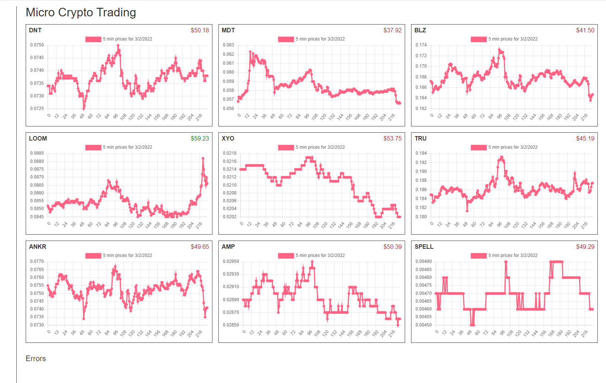
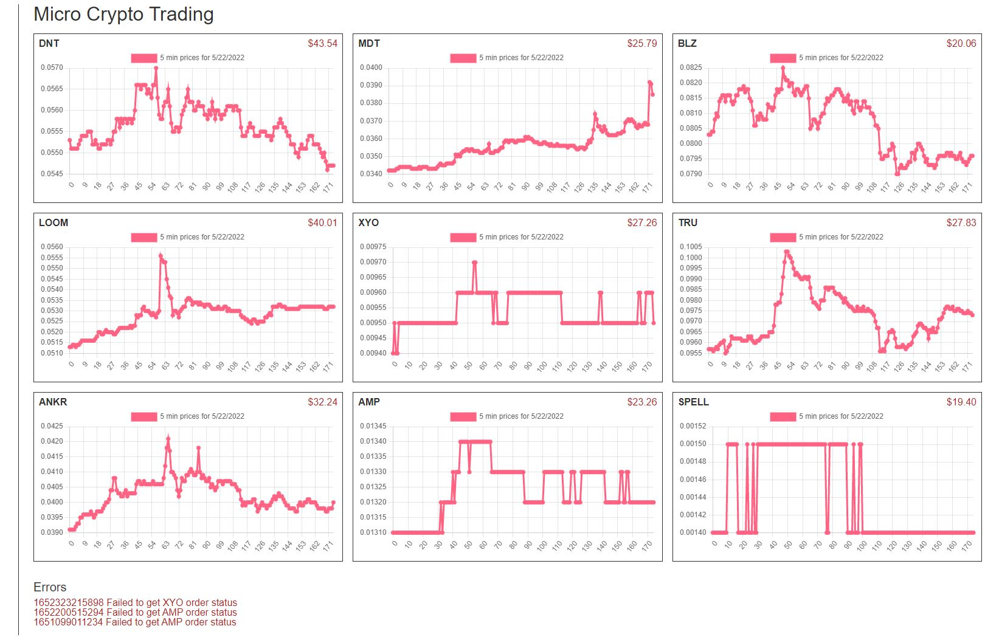

### Micro Crypto Trading
Disclaimer: I am not an expert, this is just a fun hobby thing  
Disclaimer: Also note the local portfolio balance tracker can lose/gain cents over time due to rounding problems.

### Stack
- web app
  - Plain JS and ChartJS
- API
  - NodeJS and ExpressJS ran with pm2 
  - data stored as JSON files no db
- Scheduler
  - CRON 5-min intervals mostly due to limited CMC API calls

### Data/Trading/Algo
- CoinMarketCap for price info (using free api key 333 calls per day)
- Coinbase Pro for actual trades
- no algo, just buy/hold sell if at least 2% gain

### What's in here?
* price check by CMC
* portfolio listing, buying/selling, trade statuses on CBP
* error logging to file/displayed on chart front end

The prices are checked every 5 minutes and is charted by the day (timestamps)

### Did this make money? (NO)
ANSWER - I ran this and checked in weekly increments

### Tips
- mock out the endpoints and call against that until the "algo" or "scheduled-job script" works well

### Note
The pi branch is the actual code that ran, it may be slightly out of sync but the only difference should be the included full paths for CRON to work correctly.

### Visual aspect
There is a chart that is from the 5-minute CRON job that gets prices of the crypto selected.

Red is loss, green gain over the initial $55.00 per currency. As in the value seen is current value from starting point of $55 so $35 means it lost $20.

### Final update (05-22-2022)
Scientifically speaking, I am what you call "rekt". Anyway I'm pulling out of crypto entirely and just focusing on paying down debts/saving/investing, I know even VOO got rekt recently. Aside from that just generally trying to make passive income somehow.

I'm turning this off. I know I can wait till it rebounds but I don't want to think about it anymore.

All of these started at $55.00 each