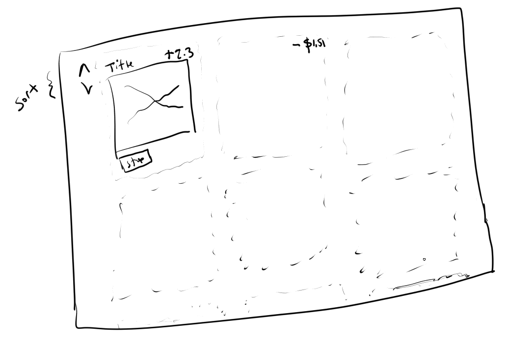
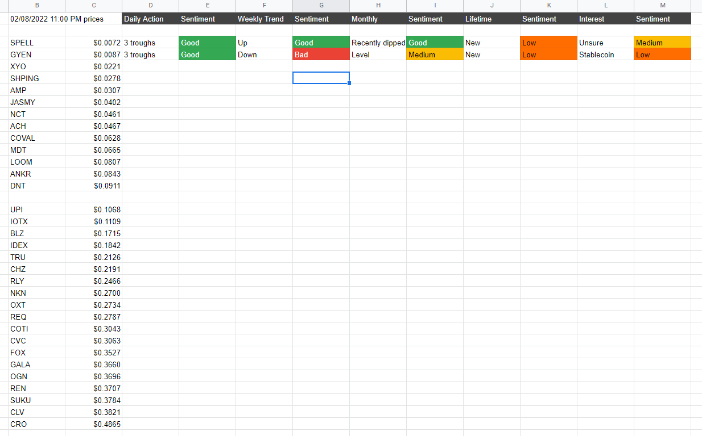
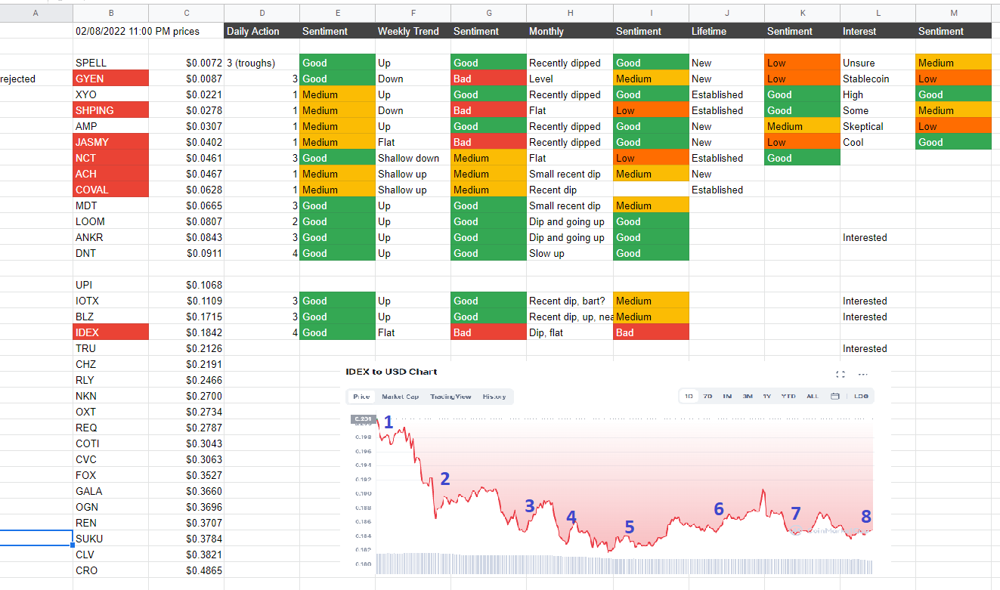

10:13 PM
So I'm just looking through coinbase pro's list of stuff that they have.

What is a stablecoin?

Ahh... stable... makes sense. Backed against something.

USDT - backed by equivalent dollars hmm

I'll be in fiat, each one has to be under a dollar.

Doge is acceptable, I've seen shib, that's super cheap... not sure I think I want like two zeros maximum after the decimal

But... my choices might be super limited too

Quick interface design

Nothing crazy, I'd probably use ChartJS for the charting aspect since they're simple line graphs over time.

So now I'm going to briefly look into these coins... I should have gone blind into it but I do want to have somewhat of a chance... like minimum coin lifetime... some history that kind of thing.

Ooh good song Stop Dragging My Heart Around

I'm looking at coinmarketcap and Google for this info right now. I have to reduce the list below to 9. I want to avoid the $0.3 ones because I only have $55 per coin which is nothing, but that's the point safe amount to burn. Don't worry I donate to local food shelters, doctors without borders, Mobian and what not every month as well as support my own families in a third world country, there's my virtue signaling. I'm also -$30K in debt or so right now (student loans baby).

Also the years are just what I see on a lifetime chart as in 2021 probably means it was made in 2020.

DOGE   `$0.1563` - won't do because popular/affected by rocket man
OXT    `$0.2734` 2019 - VPN service, hmm
AMP    `$0.0307` 2020 - flexa network? "most fraud-proof" lol
CHZ    `$0.2191` 2020 - sports fans
CRO    `$0.4865` 2020 - merchants ability to accept crypto payment
LOOM   `$0.0807` 2018 - highly scalable games dApps
CVC    `$0.3063` 2017 - Civic verification (interesting) KYC like the jelly? No customer
DNT    `$0.0911` 2017 - decentralized community/distrcits, a lot of these are Ethereum based
SPELL  `$0.0072` 2022 - wow this thing is brand new, Abracadabra lol, interest-bearing crypto assets interesting
OGN    `$0.3696` 2020 - p2p marketplaces
GALA   `$0.3660` 2020 - games, some kind of not NFT but idea of "it's yours"
IOTX   `$0.1109` 2018 - IoT interesting, sounds wasteful if the compute is low power "acrylic graph"
CLV    `$0.3821` 2021 - cross-chain compatability DeFi interesting
COTI   `$0.3043` 2019 - worlds first? merchants, some users, creating price-stable coin
REN    `$0.3707` 2018 - Kylo? multi-chain decentralized finance ecosystem BTC to ETH
TRU    `$0.2126` 2020 - uncollateralized lending on-chain credit score interesting, it's not good to see most of these are -6% or whatever
RLY    `$0.2466` 2020 - another ETH based thing, creators and online communities to launch their own crypto great, oh for fans/merch interesting
NKN    `$0.2700` 2018 - damn there's a flat wasteland lol for 2 years, economic incentives motivate users to share network bandwidth hmm, these sound cool but sketch
IDEX   `$0.1842` 2019 - decentralized exchange, order book and automated market maker, secure protocol and earn rewards
ANKR   `$0.0843` 2019 - web3 infra cross-chain, interesting
XYO    `$0.0221` 2018 - decentralized network of devices that anonymously collect and validate geospatial data, damn this sounds mad interesting
REQ    `$0.2787` 2017 - creating and requesting payments
BLZ    `$0.1715` 2018 - damn this one has done nothing but lose money from inception, decentralized storage, that sounds interesting
JASMY  `$0.0402` 2021 - been down too for a bit, IoT, edge computing and IPFS ehh I like that, it's been the same for like 7 months though... hmm
SUKU   `$0.3784` 2020 - weird looking graph initially, in green though but up there in price, supply chains
FOX    `$0.3527` 2021 - this one is active, arcs in seems like every 2 months, kinda sucks
MDT    `$0.0665` 2018 - lol omg it's just red, SEEEEING REDDDDDDD AGAINNNNNN, data providers/buyers huh
COVAL  `$0.0628` 2015 - lol "welcome to the circuits of value" damn this one's old wow, I think I'll look at the daily charts for a clue on potential action, create "Vaults", tradable token
GYEN   `$0.0087` 2021 - wow this graph is bad there's like nothing on it/flat line, oh maintain 1 yen or I think a cent, yeah it looks to be stable ha, not going to use this then
NCT    `$0.0461` 2018 - recent spike in value, wtf is a Hashmask, NFT SCAAAAAMMMMMM, these seem so dumb to me use a GNN to make them and boom printing money?
ACH    `$0.0467` 2020 - only recently did stuff in July, utility token incentivize adoption of payments through crypto
UPI    `$0.1068` 2020 - collecting and monetizing data about pets lmao, IoT sensor huh, "Pawtocol" lmao omg
SHPING `$0.0278` 2019 - only recently in 2021 did it have action, consumer products, reward customers for watching videos, writing reviews, scanning receipts hmm

Lol the Twitter feed on SHPING is funny. I can see how Twitter is influenced.

11:08 PM feeling spent, I'm at COTI lol, keep going (net swimming scene in Finding Nemo)

First thing I'll do to slash and burn this list is go from bottom sort (target cheapest ones) then most interesting

Cheap is so I theoretically last longer (oh?)

Oh my god why does the $ make things italicized... well that was nicely formatted but the back ticks messed it up, oh well

Just thinking about volatility scanning, I'm not in it for the long run with this stuff, I need results in a month so I'll look at the chart action in that scale.

11:47 PM

well I got done with the list above...

I'll pull all the cheap stuff out, I'm making a spreadsheet just to help with sorting price/names

So there are 13 under $0.10 in price

I will filter through them by daily action (looking at chart) and personal interest

12:03 AM
Oh man this is going to take a while...

Once I reach 9 I'm done, it will primarily be on chart action, this is not a long term bet thing, for that I would use real stocks/index funds or get a higher paying day job.

I don't really have an interest in trading, I'm not a math guy, I go to a casino I lose.

12:21 AM
I will do at least one "expensive" one

Ehh nah I'll just stick with the cheap ones

The winners are...

SPELL, XYO, AMP, MDT, LOOM, ANKR, DNT, IOTX, BLZ

I just want to emphasize how uneducated/unscientific my approach is, this is what I consider "action", the "troughs"

Chart has the watermark but this is Coinmarket Cap

