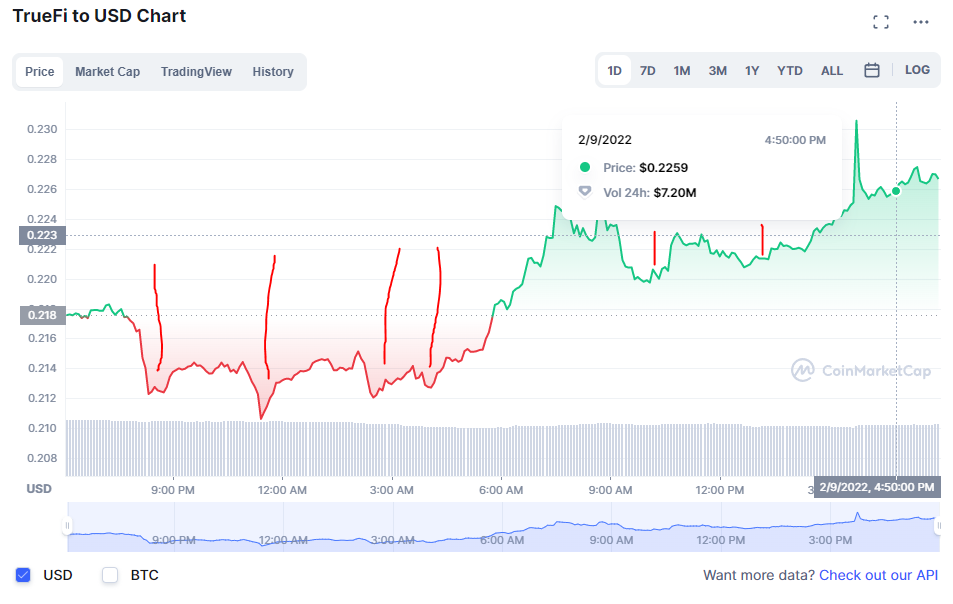
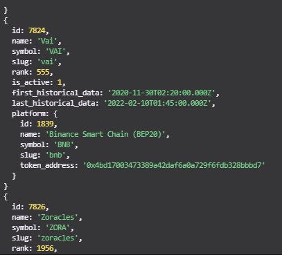
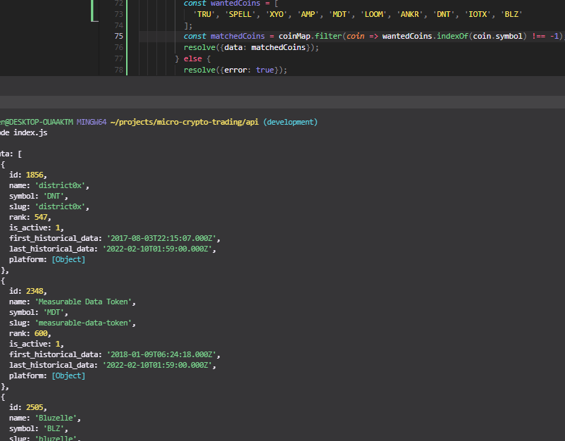

Oh yeah I did have a thought about using a differnet coin, not one of the 9 I picked for the testing ground.

To make sure everything's working before I commit to all of them running at once.

There is a safety net where the portfolios will be limited to what money is in them.

I'll have to look at that list from yesterday and find one to work with.

Yeah I'll go with TRU it has good indicators from my dunce scale.

This project actually shouldn't take that long to develop... there are some things that would be more tedious like if I wanted to add Twitter parsing or something.

6:02 PM

Well I'm mentally spent, can't work on math stuff so I'll just do work on here.

I need to establish the API calls and get a price.

Then I'll do some initial "math" regarding looking at a chart.

By "too spent for math" I mean learning something knew.

I've interfaced with the coinbase pro API [in the past](https://github.com/jdc-cunningham/cbp-cost-basis-fifo) so I'm re-using some stuff from there, namely the authentication for requests

Otherwise I am looking at their [API docs](https://docs.cloud.coinbase.com/exchange/reference/exchangerestapi_getcurrency) to figure it out.

The way I double wrap a promise with a async/await is suspect... but every time I try to use async/await on its own, it never actually waits.

This is odd, don't see a price

Hmm I might need another price source... I don't want a websocket, I'm not dealing with that kind of precision.

I still have Bobba Fett to watch

I need to get a price though and analyze a chart with my amazing skillz boiiiiiii

Let me do some back of the sack calculations, in today's daily chart, it gained $0.01 lmao

The amount I'm putting down (assuming 100% buy) is $55 / $0.218 -> 252.29 coins

Oh yeah and gain is $2.52 from starting point of $55 it's a 5% gain

I gotta do this stuff quick, because I think crypto is on an upward trend in general from a slump for over 2 months

I'm going to see about using Coinmarket Cap's API

Oh yeah I could also just buy and hold for a month on at least one

I'm looking to try different strategies per, strategies lol, subscribe to my channel to learn these secrets

You can do 333 free calls per day

I was thinking about every minute checking but that's too many calls ha, it's 333/9 so it's 37 requests per day.

I  guess best I can do is hourly which I think is okay since the dips are few, for example:

I see 6 events there

I still have to find those min/maximas too "mathematically"

So it'll be an every hour CRON job on a Raspberry Pi 2 B

Lol I try to use their API andi t says deprecated

Ehh this doc sucks... doesn't really make sense like where tf is the price check

Let me try it maybe I can get them in bulk and save on requests.

Ugh... why couldn't they put a query example for dummies like me that barely knows the difference between a header and a query parameter

Their freakin code sidebar on the right blocks the docs on the left at 1080P hmm

At least one slug...

Damn these slugs are full words

Also my axios request catch doesn't work right

LMAO I'm just burning through these API calls

At least they don't count your failed requests ha

I don't know what truefi slug is...

I'll just call this map and store it somewhere

Damn it it's an array and I have loop through and dump them, omg nested data keys

Damn there's a lot lol

This is it looping through them all

Damn... 17,996 coins lol shit

Alright so what I want to do is filter out the ones I'm interested in.

Nooo... listening to sad music, particularly the ones I would listen to before heading out to bars

Nice, randomly think of King Louis from Jungle Book "have we got a deal?"

Ehh it's lazy but works, I just need this once

Tu tu ruuuuuu damn it that's in my head again

The market cap bit is interesting, need to look into that, I'm just seeing the rank in the data.

Oh shit... there are duplicates of symbols TRU and TRU as in Truebit vs. TrueFi... huh

Yeah so that's why there is the id

It says comma separated can I put in all 9?

Cool it works, passed in the 10 coins and it gave me back all data...

What I'll do is keep a JSON file log per day and fill it up with this data

Idk... I guess I could use something like mongo but ehh

Lmao percent_change_90d -62.7% great... that's a good sign

