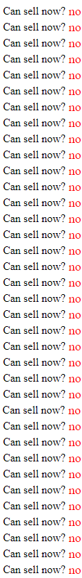
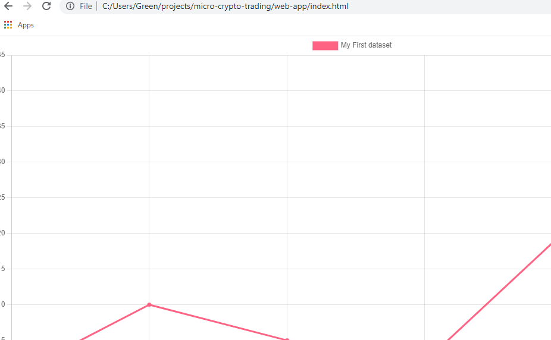
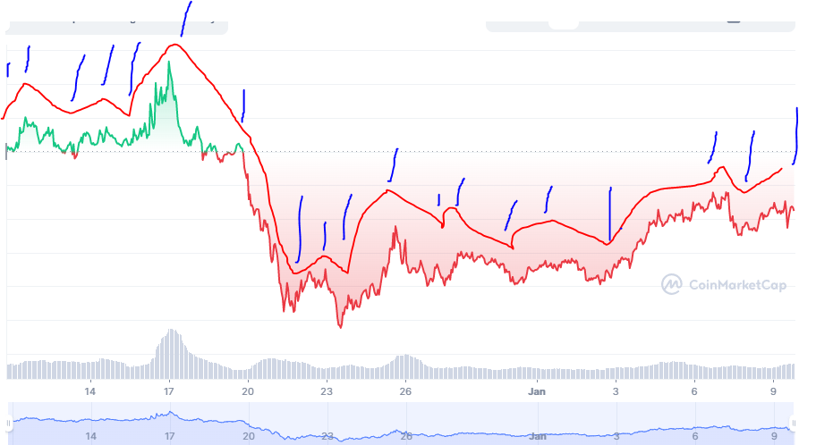
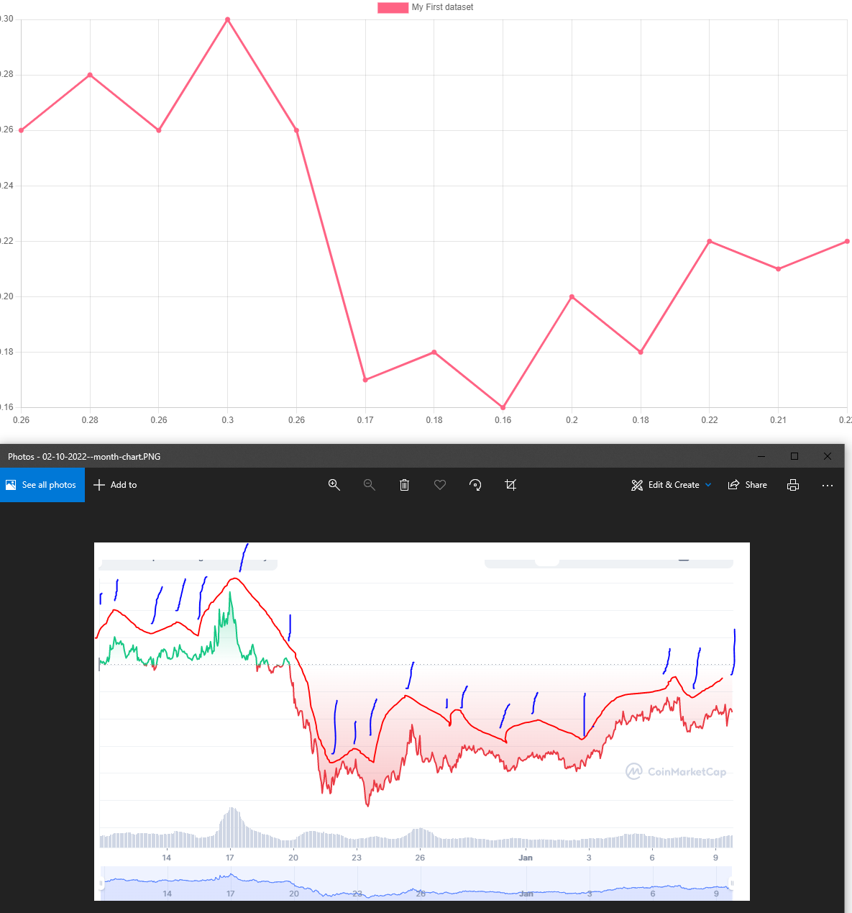
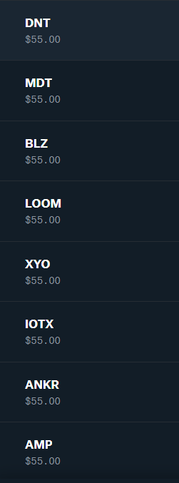
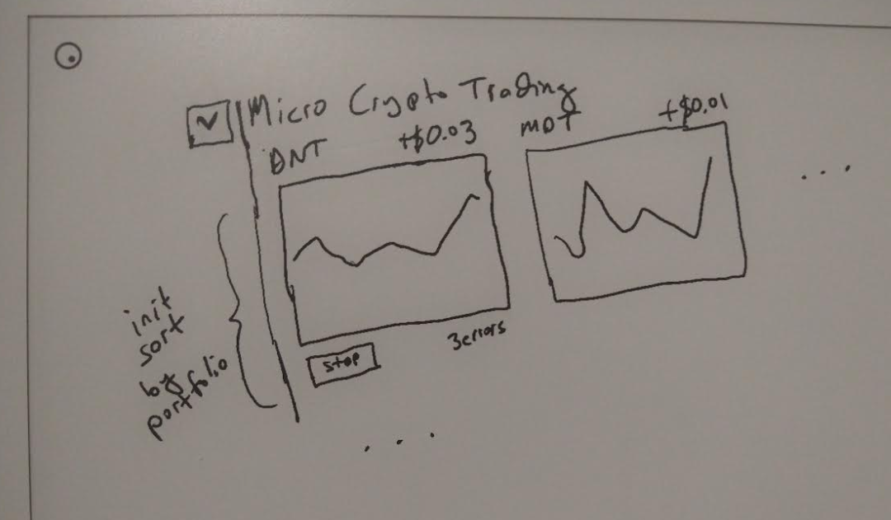

Well... I'm super tired today and I can't really do anything difficult.

So I'll work on this/screw around.

Look at that, we're already up $0.68 hell yeah I can quit my job soon

Let's see if we seel while we're up... damn... 

You lose $0.28 for fees but looks like you gain 54.96 - 54.46 -> 50 cents

I do want to do some error handling like it fails to buy, too expensive, need a notification system

I am jumping the gun on this project

I just don't want to spend much time on it is the thing

There is something else too like at what point is it good to sell

Holy crap earlier today it dropped by a cent so I would have lost like 2.4 dollars huh

Anyway let me sell this just to cross that functionality off the list

The "is it worth selling" will be implemented somewhere else

So if I can potentially do 333 calls a day... 12 price calls per hour, that leaves me some extra

So the job would run every 5 minutes

Song's on my [miiiiiinnnnddd](https://www.youtube.com/watch?v=A3M-XFxF1UQ)

Crap can't use interpolation/literal in accessing process.env

Well I missed my selling window but let's see

wtf it's still undefined

This doesn't want to work for some reason

```
const getPortfolioCredentials = (portfolioNumber) => {
  const idStr = `'CBP_PORTFOLIO_${portfolioNumber}_ID'`;
  const keyStr = `'CBP_PORTFOLIO_${portfolioNumber}_KEY'`;
  const passphraseStr = `'CBP_PORTFOLIO_${portfolioNumber}_PASSPHRASE'`;
  const secretStr = `'CBP_PORTFOLIO_${portfolioNumber}_SECRET'`;

  return {
    id: process.env[idStr],
    key: process.env[keyStr],
    passphrase: process.env[passphraseStr],
    secret: process.env[secretStr],
  }
}

```

Seems like it [should](https://stackoverflow.com/a/66626413/2710227)

So... let's do it the dumb way and manually write those out

Oh no it's dipping come back!

Nice I have it waiting to be sold... curious what the fee is, is it 0.5%?

Anyway I can jump to other things while I wait for that

One thing that's "hard" is the JSON-file-based db which yeah it's stupid but this is not performant.

I just don't want to deal with setting up some DB/specifying the schemas

I also have to remove TRU from here and use all slots, I've done the initial testing required

It's almost sold I'm waiting

One thing I need to do... noo lol it went the other way was about to break $0.229

I need to pull historical data just to have a replicated graph locally and then I will visually figure out what I want to get (those peaks/troughs) and confirm against the chart once I have a function or two written.

Then I'm not going to use historical data or something "back testing?" but rather I'll just start tracking the price per my logs... because I'm not hooking into a websocket/dealing with real time stuff... I don't have a lot of money to use for the small rises.

On RH I had a share of VOO and that made some money, that's like a stable long term investing to me... this is just screwing around with an automated system/shooting yourself in the foot.

I have two stocks left in my RH and they're both down about $8 total which isn't really anything. I'm just trying to avoid selling at a loss with my main coin to free up the money for this project.

I already have had to sell and man I ate it... like almost 50% loss sucks.

Of course it takes like a week to move that money from RH back into cash so I can't really use it anyway. Right now my income is not a weekly/bi-weekly basis so I literally have no incoming cash flow.

My other CBP project keeps track of my loses and yeah it's nearing $2K lol, rename the app "pain tracker"

Oh okay this one's loss is not too bad... man what sucks is tax time... through H&R block I have to enter every single one of these entries by hand... sucks, mostly because H&R block catches this work in one state, live in another state, avoid double taxation deal better than other providers.

At least I won't have that problem next year.

hmm looks like this sell is not being reflected in the FIFO calculation, the loss is about 20% though from initial purchase price

lol yeah so I lost like $12 on that sell

Funny though:



This is another variation of that CBP cost basis thing I made and yeah... it tells me what I know, I got rekt.

These are all tiny amounts but yeah "buy the dip" as they say but it keeps dipping

> sold 0.0## at: $66100 on 2021-11-15

That was nice, that was before it reversed and hard

Lol he doesn't learn

How do you make money? Build things people will pay for.

Lucky for me, I am pretty employable and the field I'm in (tech) has a lot of opportunity.

I also cover my own ass/have back up plans like this Upgrade plan thing for example, it's a loan but in a credit card form/you don't owe anything until you use it.

That's a worst-case scenario thing, I would try to avoid using. It's not like a credit card where you can just pay a small amount against a large balance and it stays the same. This will grow to match whatever you owe proportionally.

I would sell all of my shit before I used this thing but yeah, credit/loans are cool if you know how to use them, I learned that the hard way.

WTF... the sell didn't go through or I put in the wrong amount... after the chrome extension injection goes through (pulling Reddit content into CBP's interface) it does break part of the site lol the "Select Market" drop down in particular.

Awe wtf... my sell was a decimal off lol

There we go... there's my triple-digit loss that looks right lol

Okay... I want to get historical data and do that math stuff, that's like the hardest thing. Rest is just wiring shit same old CRUD glue

Oh crap I can't get historical data huh (my plan isn't part of it)

Well I can use fake numbers and then work from that

Alright I'm going to work on the web app real quick

I'm using this react-chartjs-2 component

Ehh basic demo has a problem I'll just use it straight up, I know it works

Mmmmmmmmmmmmm I don't need React for this.

KILL IT!

Ugh... I can't turn it off, anxiety, something is wrong, what is wrong? All my bills are paid for the month. I have more than a year of burn rate.

Just enjoy the day, I get these moments where I can't have fun... I can't watch TV, I'm just like alive but you know, not actively doing something idk. Those are when I'm super tired. I'm tired today but not that bad I got some sleep.

This project has a month-long "study" so I need to get it done to some state where it is automatically trading.



I was a front-ender for over a year as in PSD to HTML and I hated it. I can make almost anything at this point, I just find no pleasure in making some pretty scrolling effect or a cool-looking button.

So I got out of that job and landed a software engineering job thankfully as in agile/scrum, tech design planning, implementing, unit test/regression testing, pipelines, etc...

TRU is starting to turn around but still not sold.

Let me do that math/fake analysis thing real quick.

I'll populate this chart with some data that looks like a cryptocurrency plot for a day and then get those max/min values.

It does suck that I don't have history to work with... but I can gauge the frequency visually and put that in... for an estimate on daily action in a given day.

I don't know I was going to do some like word counting on subreddits it's not hard, because you can take any url and turn it into text with their JSON thing.

Like [this](https://www.reddit.com/r/Bitcoin/comments/sozb08/daily_discussion_february_10_2022/.json)

And then you just parse it and look for stuff. Of course they have an API and what not.

Oh I could also use min-max price range history too.

This is probably going to be a guarantee of wasted money, I'm not like a math guy or I see patterns or anything.

It's just fun for me to make systems that work, you build all the little parts and connect them and it runs

Alright switching to energy drinks and from Future Funk chill music that I know to metal that I know to get pumped

The known music bit helps to not get distracted, if I really want to focus I'll loop some songs over and over

I need to build the history every time those 5 min price calls run.

If the JSON stuff becomes a problem I'll migrate it. But let's see, there will be under 9000 points of data at least.

I think reading/parsing that is not an issue.

The Pi has a lot of power too since it's quad core and it runs every 5 minutes so it's not realy constrained by time

IN WAAAAAAVEEESSSSSS first song in this set of music

I like this kind of freestyle development where I don't have to think, no testing or anything, just manifest it from nothing, it's not production, it's just for me

Need a list, my mind is jumping all over the place right now
- [x] plot mock graph
- [ ] determine min/max
- [ ] determine data structure to hold future data as it's gathered
- [ ] render the 10 different charts
- [ ] setup the portfolios
- [ ] bridge front end to back end
- [ ] start process of buying/selling

Yeah I think I'll just do it, today is the day which will be the "starting point" of the month-long run

Which means I'm stripping away a lot of the crap I initially had in mind because again... I have other things I gotta do.

Building a company from the ground up and the robot project, pinephone pro app project, etc...

Ooh $0.2244 not good, eventually I will just dump this doesn't matter if I lose just to free up that portfolio and generate new creds for it

This is a month chart but shows my intent, plot these basic points



max and min range (in loss) is 0.26 to 0.22 this is a month chart for TRU

Something like this



I do find myself asking "what's the point" but idk it's the process I guess that's life right, the journey.

I am the sentient soil

I'm going to think about how to analyze this, I'll just keep the data somewhere for now.

I need to go back to setting up the data/collecting it.

Dust off the remarkable 2 to maybe use it

I'm actually just going to pull TRU out of the API code right now and deal with it through the CBP interface (to close it out)

So the base

I'm going to call the price function again to remember the response structure

So you get price, percent_change_1h that's nice, well I'll just put it here so I have a copy

```
{
  USD: {
    price: 0.09271582944997463,
    volume_24h: 4864635.48213318,
    volume_change_24h: 45.5017,
    percent_change_1h: -1.63192968,
    percent_change_24h: -2.42194662,
    percent_change_7d: 16.16780857,
    percent_change_30d: -16.3918921,
    percent_change_60d: -35.64208737,
    percent_change_90d: -50.08424973,
    market_cap: 55629497.66998477,
    market_cap_dominance: 0.0028,
    fully_diluted_market_cap: 92715829.45,
    last_updated: '2022-02-10T19:35:00.000Z'
  }
}

```

I'll use a timestamp when the API call runs for matching

I guess I'll capture the 1h, 24h, 7d just so I have it to use later on, I think the hour one is the most useful

I mean yeah if you look at that, it's showing that it reversed trends (from negative to positive), and it's starting to flip over to positive... (hopefully)

I'll call it now I think crypto is starting to turn around as a whole again... hopefully back to the "$60K" level for BTC and everything else follows but not sure

lol BET if it's up a month from now

Yeah... at this time I don't know what to do with that data

I realize you need a starting reference point, I was able to do that by using 1d, 7d, 1m charts like "oh yeah it tanked recently but starting to go back up again" = to me, not a bad time to get in

First run...

Lol immediately failed nice

{"1644523629376":"failed to update crypto prices"}

My deadline is to start this job tonight at midnight... could be earlier I'd like to sleep if I'm sleepy then hopefully/need to be

What's bad about prod testing is you're burning through your API calls, can just mock it out

Ahh I'm gonna have to do a sort by key deal later

It should be in order I'm using unshift

Cool it works

NOOOOOO it went up to 0.27 and I missed it! I sold at 0.229 lol

Ahh well unexpected that's the range sell right there

Selling fee was the same

Made 67 cents hell yeah

Well now I can clear out the portfolios and sTaRt StAcKiNg

not really I have to wait till later when it's on, get the whole system in place

It has to run without incident/I don't interact, if I do I have to log it in the failure file

Okay I'm starting to setup all the portfolios, have to setup all those creds and giving them their starting money

I have to dump the portolios and get their ids later

This does suck doing this manually at some point you could have an automated process run through a list of info

hehe "secret" said in ManlyBadAssHero's voice

Ahh man, when you create an API key the passphrase is prepopulated with a shortish string so I replace it... but I gotta remember to clear it... otherwise it won't match and then when it tries to buy it fails...

Or I don't click the two permissions view/trade, which really I think I only care about trade

Ugh I just feel bad... like I'm bored... don't want to binge eat been trying to fast

Caffeine is what's getting me through this project, it's just work, there's no new learning or anything

Alright all the 9 new portfolios have been generated, creds generated, adding money to them now

Giving my little workers money (ha) that's not how it works.



That's not all of them but they're all filled

Lol I remember like 4-5 years ago I was screwing around on Coinbase (not Pro) and I would buy $5 worth of crypto here and there but I was losing like $1 something everytime ha... even worse when I sold.

Noooo BTC is down trending right now for 1m chart, ahh it's doing these waves hmm saw pattern

Alright... where am I

Oh yeah I need to get the portfolio ids still

Also put a server ontop of these functions and have the web interface pull it.

I wanted a global sort for the chart render by gain/loss, which it's just a top-down array render thing

Ehh I could use something fancy like Robot maybe later

I do like the little animation of the chart it grows

I do like the feeling of writing on the remarkable2 mmmm

This is the design I already had in mind before. I did think about something, the trades should log any problems and then it'll show up under each chart.



Ideally I'd have an alerting system which I have a few like email, text... but I gotta set it up.

Oh there is the desktop alerting... that could be something since I've used that before/will probably have this tab open/add it to my list of Chrome startup tabs

In general this has low risk as far as not spending more money than allocated

I just don't want to have huge gaps in data or something

I think by 5... well I have 246 calls left, if you started at 5 PM, you'd have 7 hrs * 12 -> 84 calls that's within budget

I could start collecting data at that point with regard to the running CRON job and then I can keep working on the rest of the stuff...

It's technically not "hands off" running though but I'm also starting from no data/no historical data

So I gotta build it up, I have to "finish" this project today though.

Gonna have a snack break, keep the energy up


