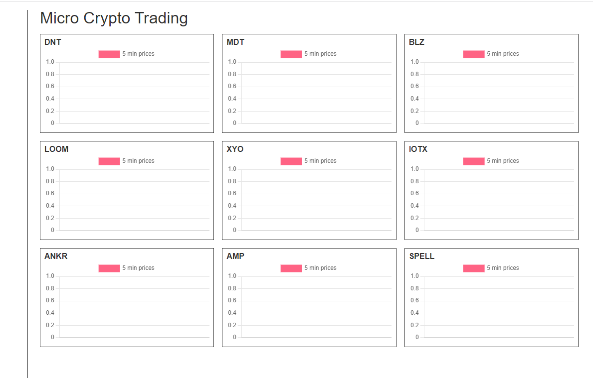

Well I'm kinda in limbo right now, already wasted my morning with some other stuff.

Need to reconvene and decide on next steps so I'm back to this.

So where was I at?...

I need to read errors

For now I just have an alert

I don't know I'm really losing interest in this project, have other things to do

There's nothing new/interesting about this just a "wouldn't it be cool if"

Got distracted had something come up, back to this

I have this thought where it should buy/sell in a day maybe every day.

Or at least compare the previous buy/sell within a threshold (that overcomes the fee)

I still do not have a "system" thing running, because the balances are not sent back by the profile API calls... so I have to track that in the app as it runs/does trades from the starting value of $55.00 per coin

So each coin needs a value indicator gain/loss

The UI is empty but I think this is looking good

The trick is when do you enter the market. I mean it has to... and the hope is it grows at whatever you buy from... so it can buy now.

okay...

So right now I have this file whihc is the portfolio_values.json, tracks balance... should have both I guess up to 4 places accuracy... no I'll do one, last time I couldn't buy a value that small.

Distracted at the moment

It's dipping right now would be a good time to enter, yeah... I think it'll just buy as soon as I turn it on

So CRON ticker/job runs
- get price, update price data
- check if buying
  - no prev_buy_price buy now
    - check wallet balance (json file value), apply fee (included in function)
    - handle succes/fail
  - basic algo
    if price is greater than before, check by how much, if threshold met sell
    otherwise wait for dip to buy in again
    DNT example today:
    - started at $0.092
    - dropped to $0.090
    - rose to $0.097
    - dipped to $0.087

With the $55 starting amount
say it ran at that moment/today
- balance to buy with is balance - 1% fee this is upwardly rounded for safety
- $49.5 / $0.092 -> amt in DNT which would be 538.0435
- 

that's how it goes

The amt sold will always be 100% so that's a driver eg. if amount is 0 try to buy

Of course there needs to be a previous price comparison

Damn I'm spent, I did get better sleep today though

Oh crap... I forgot... these limit orders just be logged, I don't know if they're done

Ehh... yeah I'm gonna have to run this process through at least once to see everything goes as planned

I have to run the buy/sell commands and dump the response in order to log it and also to check if the transaction is done

I will get this done tonight/get it going once I do some tests

