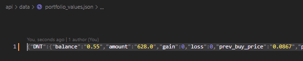
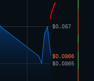
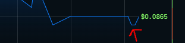
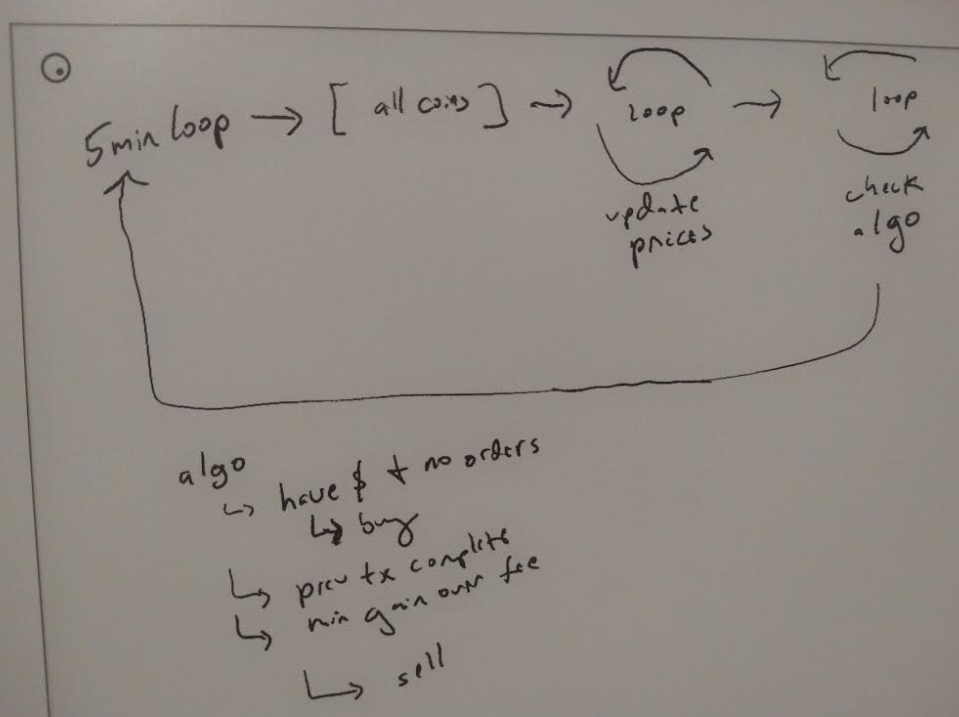

Last doing
- do another buy and see that it's written out
- pull the order by stored id to check status
- have the buy go through then sell it to log that response
- check that the chart pulls down the value based on USD or crypto held
- rest of tasks

Member that song "it's my day, my day"

Yeah got a full day, fresh brain, all for me.

Will wrap this up and go back to my robot project

Ahh man DNT dipped to 0.084 overnight

Ugh I'm stuck on this

> UnhandledPromiseRejectionWarning

I think I just got it/was looking in the wrong place

I'm making a buy order fail on purpose and ran into that

Alright this is looking good, I gotta do the order check

It's so hard to buy (price jumps beyond or below), anyway I have a status now

So I'll do a sell and get that info/check the math of the portfolio balance

Then I'll write the main looper

Figure out some basic algo to use and plug it in

Check the front end pulls stuff correctly

Then should be good to start trading on its own

I can't catch it lol, I put a buy in, it goes up more

Alright I'll refill my coffee and do something else while I wait

Finally it filled, about a minute ago I put it at 0.0001 below whatever it was at

Fee was 0.2722 which is... 0.5% yeah

Cool now I can sell, the minimum sell "algorithm" is to cover the fee in transaction and make some money

Today DNT just sank... the "ranges" are 0.091 (open), 0.087, 0.085, 0.084 so 8% difference today

Seems like it should be dynamic but maybe an estimated 5% gain is enough... so it has to increase by 5.5% to sell.

Out of $55 I have $0.28 left and 625.1 DNT

I have a prev_buy_price variable and amount held right now, I need a function where I put this in and the current price to see if I can sell.

The math does not line up though regarding balance.

I factored in the fee but I think it needs to be added on top...

I'm going to manually sell at a loss so I can check if my math matches CBP

I want to see the 5 min charts grow over the course of the day

Lol it's like "no turn around"

noooooooo

It's going down, I could use another portfolio but I have to reset their balances to their starting points

So I'm going to force the the coins to buy as soon as it turns on.

Then from there it'll start the algo, because at this point I don't have any history and I'm not analyzing the charts because I don't know how to read charts/apply some thing to it eg. bolinger bands.

I'm just using the threshold.

I could do something where the strategy is to hodl or minimize loss by dumping...

But... it's an active trader so I guess it should not hold

I'll have to check the maximum loss in a month per coin

I'll do weekly because I don't want to not do anything for 4 weeks or whatever

I'm using the prev week open vs. prev week close to get these "max_weekly_loss" percentages

BLZ looks good it's growing

These values are not that good, because the max is usually a peak, an unusual thin line spike

Also this is version 1 it can be improved in the future

Yeah so right now I lost $0.92 during this testing

Alright let me see if this math traces right

Buy looks good, portfolio_values.json says $0.28 for balance

prev_buy_price is there

Oh man yeah you can have partial fills and it takes a while to finish interesting...

At least the status guarantees it is completely done

It's weird... you send the command, and then you update the balance even though it's not technically done... but there is a check if the last_tx_complete so you can't proceed until that's true as in try to buy again

I'm just running manual buy/sell commands as I develop it

no... it's turning around lol and my buy order hasn't been filled yet

OMG whyyyy it stopped dipping

Oh it just filled look at that, 10 seconds after I wrote the above

I need to add a transaction updater function

Lol what it says done not filled for status hmm

Ahh well les go

Ehh mixing purposes of a function

Alright now to wrap up the sell portfolio update

Hmm need to see if this is true, if I made 38 cents yeah boiiiiiii

I think all this rounding will result in lost money (Office Space)

But I need this to get done so I'll sell at a loss again

Haha says I'll lose 27 cents let's see if it's true

The "algo" is something like this

The min gain thing I'm still unsure about, I mean it depends on reality/the day's ups/downs but I'm not doing that right now, just a fixed estimate based on manual checking (today).

I'll just look at the smallest peak and if the math works out regarding overcoming the tx fee

Oh actually it just has to exceed the 0.5% tx fee probably at least twice so a 1.5% gain at minimum

Let me see if that makes sense

I have 630.2 DNT right now which were bought for 0.0864 fee was 0.2389

Sell price would have to be 0.0877 which if you sold -> $55.27 - 0.5% is 0.28 so you'd be back to $55 or just under

Well... there is 0.28 still in the wallet so you'd have $55.28

Yeah that's not really working, I'll set it to 2% at least of rice in prev_buy_price

If it's losing, it won't sell unless it hits that maximum loss which is kind of insane one of them is like 30% loss

I'm still waiting to confirm the sale results but I'll work on that thing described above

Oh it's been selling some just again slow to fill the order

Ooh it's filled nice, my wallet says 54.45 which...

Oh that's not good the previous buy did not reduce the wallet balance

Hmm I'm going to have to do this again, buy/sell

Damn it the lag is so slow... I might switch to a different coin that has higher transaction rate

I think AMP is my best bet out of these 9 that I picked

Oh LMAO I never finished this portfolioCredentialsMap

Crap... I keep getting the "size is too accurate" so I'll have to define those before it runs for all of them

Ehh I'll just buy in whole numbers

Oh no my credentials map might not be right, I bought something but not sure what

LMAO I ordered something but I can't find it

wtf... it used the DNT portfolio interesting... makes sense the portfolios are not tied to the currency

Oh yeah I didn't finish updating the copy-pasted values makes sense

Maybe that's it AMP has 99 million volume in 24h and DNT has 5

BLZ has 37mil

The AMP buy I put in is going to take a bit to sell, well I can just sell at a loss and keep going

I'm trying to make sure the balance math is accurate and I have to keep resetting the portfolio_values.json back to the starting price

Yeah... the math is off by a cent in LOOM's case

I need to get this done, I want to work on my robot project again

Alright the LOOM buy went through now to sell it to check the math

Yeah so for selling I just have to check if the current price exceeds 2% of previous

Those are weak gains for sure

Yeah my math is not right... 54.84 is actual value but I got 55.39

Ha tried to sell something I didn't have "insufficient funds"

# COME BACK WHEN YOU HAVE SOME MONEY BUDDY!

(Bioshock reference)

I'll use floor for the portfolio amount

Ugh... crap this gain of 1 cent or loss of 1 cent is not good... because it's enough to affect the math

I mean it's 5500 cents but yeah

running this thing 288 times a day...

Alright I'm just going to accept it, there's too much juggling/rounding going on to nail down where it should actually be done

Damn this transaction lag sucks for development, I mean you could mock it too

Damn it I keep doing LOOM, like it takes forever to fill an order

Use AMP

I'm also not factoring in the volume traded transaction fee decrease, but I think it's a lot though...

It could self correct by using the order status values whihc includes fill_fees and know the "true wallet balance" by what it can buy

So it said I lost 84 cents which 53.89 + 0.29 is 54.18 it's off by 5 cents oof

I'm losing on purpose to speed up the process of checking the transactions but they're not matching

The buy math is good almost exact, this is the one that can be off by a cent

I'm trying to catch the rising price again

Damn cat's in the window opening the blinds and this fusion light beam is going directly into my eye sockets

Like that scene in Indiana Jones but it's a laser capable of melting Inconel

Damn it JS it's joining stuff together as a string, I am using parse float and what not...

I like JavaScript's loose typing though, working in C++ has been brutal for me

Ooh... it went through and it's off by a ccent balance in local log is 54.59 in CBP it's 54.58

Does a 45 cent loss make sense?

Yeah that's pretty close

Now I just need to check gain, which will take a while so I'll do the main looper

