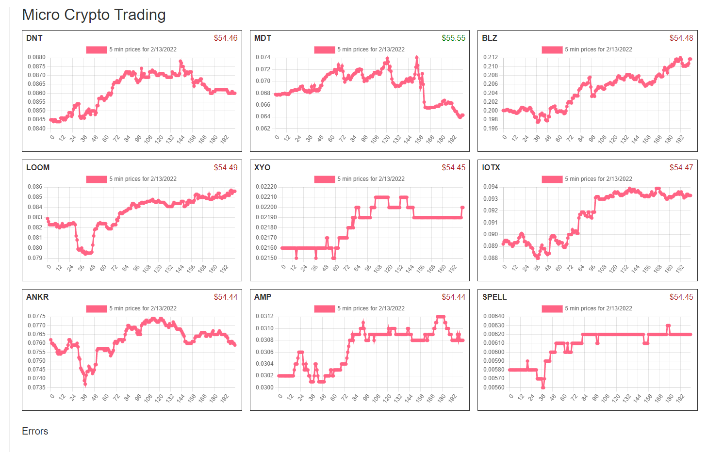
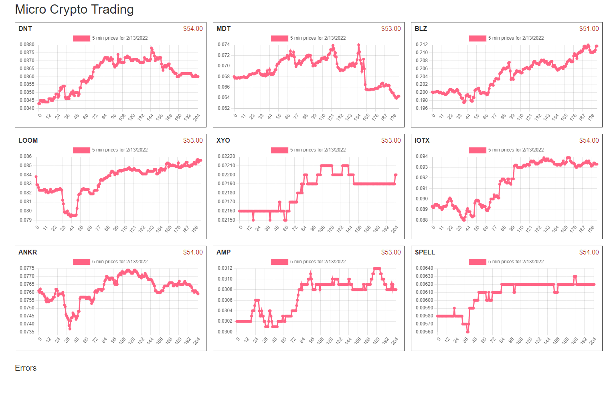

So, post overnight report

MDT kept going up so my buy never filled

The volume like trippled overnight so I missed that

Everything else is either still waiting to buy or down

BLZ is down almost $4

LOOM is down almost $3

ANKR is down $0.7

AMP is down $1.30

So yeah... made $1.09 but lost $9 haha

I need some kind of adjustment to dump what's there and buy

A simple fix right now is to override existing buys and reset the matching portfolio value that matches.

I think for failed buys if it's been an hour and the buy hasn't gone through can cancel the order and try again.

I need a cancel order function.

For sell/loss not sure

- update chart pricing, if in sell mode but tx not succeeded, use amount and cur price to gauge where it is
- add order timestamp to check if order is an hour old and still not done to cancel it
- create cancel order function

Yeah the sell update is not right

It does not update the balance like when it buys

Oh it updates it with the sold value

Which isn't really correct... should use the tx_id to check if done and get the values

it's really only a problem on the charts right now because it's not representing the portfolio balance correctly

They are all in the else condition of ternary for value

There's an out of sync issue with clearing the last tx id and last tx complete to true

Oh boy it's just getting worse, I need to pay attention

```
1644789308958 Failed to create buy order for AMP
1644789308274 Failed to create buy order for ANKR
1644789306795 Failed to create buy order for XYO
1644789306069 Failed to create buy order for LOOM
1644789305382 Failed to create buy order for BLZ
1644789304559 Failed to create buy order for MDT

1644789008447 Failed to create buy order for AMP
1644789007725 Failed to create buy order for ANKR
1644789006274 Failed to create buy order for XYO
1644789005602 Failed to create buy order for LOOM
1644789004810 Failed to create buy order for BLZ
1644789004111 Failed to create buy order for MDT

1644788708996 Failed to create buy order for AMP
1644788708306 Failed to create buy order for ANKR
1644788706861 Failed to create buy order for XYO
1644788706088 Failed to create buy order for LOOM
1644788705179 Failed to create buy order for BLZ
1644788704436 Failed to create buy order for MDT
1644787809193 Failed to create sell order for SPELL
```

Yeah it's trying to buy when there's no money hmm

Yeah  I need to stop the trading part for a bit and fix this

It's hard to code against a thing that keeps coming around eg. a 5 minute interval CRON job

I was not able to buy IOTX at all since I started this

I'm so burnt... I have to stop doing stuff today because I have to work again tomorrow full time, I didn't get to do anything on the robot.

I had a break earlier today.



This is more accurate however the losses are higher.

like right now in CBP BLZ is $51 something so yeah

I updated that so it's more correct based on the last 5 minute price

Yeah this seems more realistic ha everything losing



There is some inaccuracy for example if it's still waiting to buy technically you haven't lost money yet but it's using the intended to buy amount against current price for pricing.

IOTX is very stable though (in terms of recent days)... the buy order is for 0.08915 but it's at 0.11503 ahnd last time it was below 1 was on 02/07/2022
