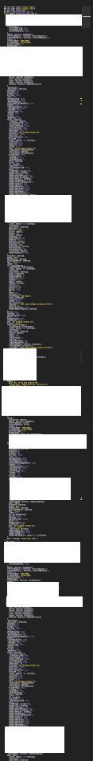

I'm pretty much done spending time on this at this point.

But the IOTX has still not bought so I'm doing a manual override there

An example price range is 0.11273 - .11144 = .00129

My "buySubtractionMultiplier" is 25 * 0.00001 which is 0.00025

Idk that seems good

So if I was to manually buy this, I'm looking at the minute chart and I see the numbers above 0.11273 and

0.11144 as recent peaks

It's actually on its way back down maybe to 0.11129

which current price is 0.11288 -> 0.00159 apart

Going to check if the decimal counting is right

It is counting them right

```
DNT count 4
DNT sell order in progress
MDT count 5
MDT sell order in progress
BLZ count 4
BLZ sell order in progress
LOOM count 4
LOOM sell order in progress
XYO count 6
XYO sell order in progress
IOTX count 5
IOTX buy order in progress
ANKR count 5
ANKR sell order in progress
AMP count 5
AMP sell order in progress
SPELL count 5
SPELL sell order in progress

```

Even XYO is able to work, I think it's the right decimal place/volume activity for IOTX is the problem

BLZ finally sold but it did not buy back in

I'm going to turn it off again and update the logic to trade

Oh yeah I think I just did a dunce move where I was editing an object in memory but not writing it out to the file so those changes were lost...

So right now only two are above original price rest are down or stuck at 55 from not being able to buy (only IOTX)

I reworked the trading code so it is based on the actual order status

Oof insufficient funds IOTX

It keeps trying to buy huh

BLZ has not tried to buy with new changes

Ehh... the IOTX buy is too low it tried to buy 0.09252

Interesting now says smallest unit is 4 hmm

Yeah both LOOM and BLZ are in done status but not buying

Still failing with these too small sizes

This doesn't make sense, supposed to trade in whole numbers

Yeah it keeps trying to sell even though it's 0, yeah has 0 amount to sell all in USD again

I put the logic in the wrong spot

OMG finally the buy's went through jeez louise

The buy is too low though for IOTX

Ugh it's still messed up, good job Jacob

I can't figure out why 5 * 0.00001 becomes 0.02188 like wtf where is that coming from

I keep getting these huge dumps when some call fails



That's just paranoia like you gonna upscale 2 pixels into a letter?

BLZ is trying to buy but it has already bought

The portfolio_value says it has a balance and gain, no order type

no amount either so the status update there is bad

currently I'm updating portfolio info in the post transaction call eg. updateLocalPortfolioValues

I'll just leave that for when the order is actually processed

Same for loss and gain that should not be a thing until it's completed

You know this is such a simple state to maintain and the fact that I'm failing to do so does not bode well for me.

Heh... like come on man it's 3 states: buying, selling, or not doing anything

AHHHHHHHH

Alright I'm going to hardcode the IOTX offset

and then figure out why BLZ is still failing to sell

Ugh almost got it, code was outside of guard and missed the sell case

IOTX is still buying the wrong amount it's too far down

This is starting to annoy me because I can't let it go, it keeps failing in some way or another

I want to move on/let it run and do something else

I see what's up too, the price I'm getting from CMC does not match what CBP shows which makes sense I guess...

Ehh the chart is still wrong... IOTX is in buy state, but showing $0

Yeah I'm not gonna sync these code bases until they're good

Quick check we are about `$12` down and `$2.84` up nice S T O N K S