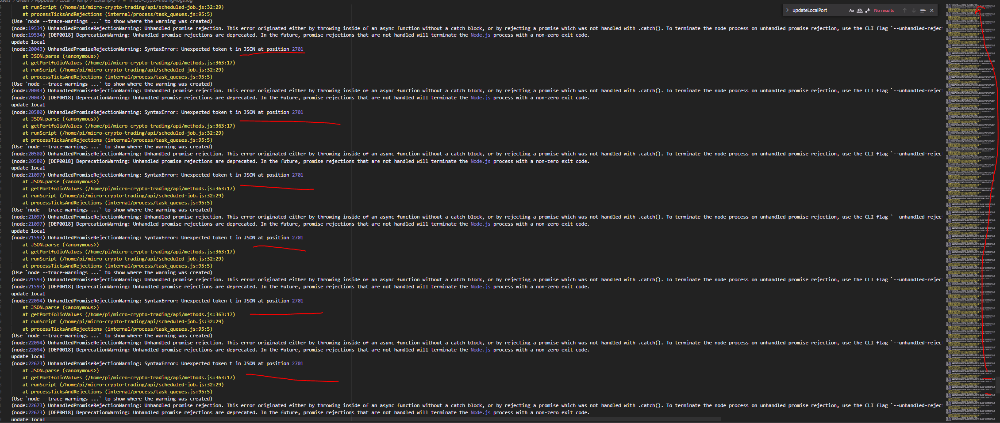

So yeah, that problem where the portfolio_values.json file breaks keeps coming back

I thought it might have been an async write issue or maybe a JSON stringify deal but nope

I did have a decent idea to log the writes

Still it breaks and unfortunately it broke overnight about 5-6 hrs of down time



Ugh

A buy went through for BLZ

The post-buy write would have fired, it did not work correctly because the balance is still full

Looks like DNT has an issue too

it's just a type issue

Oof XYO has a problem too, overbuy

The secondary amount check if there's no order type, I upped the comparison to $10 since that shouldn't happen

If there's left over money it's usually around $0.28

Another one of these came through

```
_amount_unit":0.00001,"smallest_price_unit":0.00001,"current_order_type":"buy"}}
```

I'll also turn the writes to synchronous

I'm going to swap IOTX with TRU, I will briefly turn the system off to change values/destroy-create portfolio and fund

Yeah so at this point the development branch is completely f'd, the Pi code is the baseline

night time
This thing is still failing here and there

It looks like that random append issue is gone, maybe the sync write helped

Now there's a problem after selling the buy stuff is not updated right/keeps trying to buy

Made an update will see if it helps

Good news is I'm up... BLZ is almost up by $5, all except 1 coin is above or at $55 so that's good

I'm going to move the tx status writing to the post event of the orders vs. doing one before the order and after

Man this is super f'd now the state got complicated

Sometimes amount key in portfolio_values disappears

10:23 PM
REEEEEEEEEEEEEEEEEEEEEEEEEEEEEEEEEEEEEEEEEEE

I'm going to rework this code

It's bothering me the thought that it won't trade overnight

So what do I have to do?

- I have to turn off the current orders buy or sell (sucks it's a lot of CBP UI navigation)
- match the portfolio data
- rework the scheduled job script
  - does it have an order?
    - no
    - yes
      - buy
        - check status
          - done
            - update portfolio
            - perform opposite order
      - sell
        - check status
          - done
            - update portfolio
            - perform opposite order

